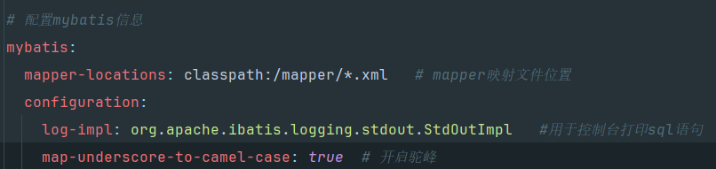
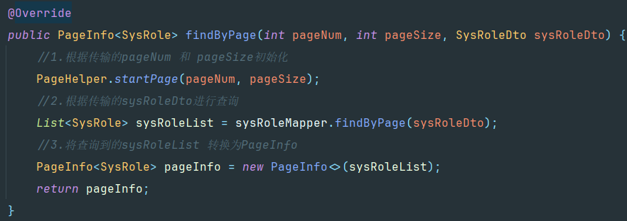

# 1.19 (后台系统 前后端的搭建以及登录模块的实现)
*前端系统架构 :*

*后端系统架构 :*

*统一异常处理 :*

`用户登录的流程图 :`

`图片验证码实现流程图 :`

`获取用户信息 :`通过登录时的token,从Redis中获取对应的用户信息(用户登录时将token作为key值 用户信息为value值存放入redis中)

`用户退出信息 :`后端根据token删除用户数据 

`登录校验信息 :`设置拦截器,配置拦截器的注册和需要拦截的url

*用户登录模块出现的问题 :*
* EliteSelection-manager
- mapper/SysUserManager.xml 无法通过.xml执行sql语句实现持久化,暂时使用注解来实现持久化
  - 出现问题为spring整合mybatis的相关配置错位
  - 解决方法

- SysUserServiceImp类中的login()中无法通过key值获取redis中的数据,进行校验;
  - 解决方法为注入RedisTemplate时设置它的key 与 value的泛型(String)
# 1.25(权限模块的实现)
## 角色管理
*功能划分为 :*
- 角色的展示(分页展示 通过pagehelper插件实现)
- 角色的添加
- 角色的修改
- 角色的删除
*角色管理模块出现的问题 :*
- pagehelper 插件没有实现分页功能
`pagehelper 实现分页的流程`

## 用户管理

## 菜单管理